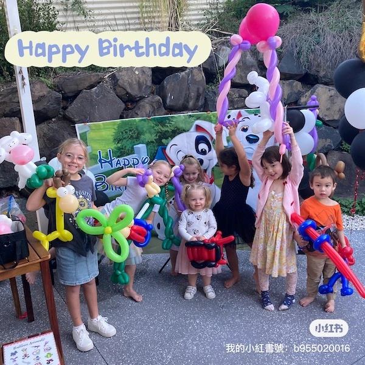

# 🎈 Joy Joe Balloon Twisting - Image Audit & Optimization Report

## 📊 Current Image Analysis

### **Scanned HTML Files:**
- ✅ `index.html` (Main landing page)
- ✅ `gallery.html` (Portfolio showcase)
- ✅ `who-is-joyjoe.html` (About page)
- ✅ `how-balloon-artist-entertain-your-children.html` (Service details)
- ✅ `testimonials.html` (Customer reviews)
- ✅ `frequent-asked-questions.html` (FAQ page)

## 🖼️ Complete Image Inventory

### **1. Logo & Branding**
| File | Location | Usage | Priority |
|------|----------|-------|----------|
| `logo.png` | `assets/img/portfolio/thumbnails/` | Navbar logo (all pages) | **HIGH** |

### **2. Hero/Background Images**
| File | Location | Usage | Priority |
|------|----------|-------|----------|
| `bg-masthead.webp` | `assets/img/` | CSS background (hero section) | **HIGH** |
| `g6.webp` | `assets/img/portfolio/thumbnails/` | Main hero image | **HIGH** |

### **3. Service Carousel Images**

#### **Balloon Twisting (BT) - 6 images**
| File | Location | Usage | Priority |
|------|----------|-------|----------|
| `BT1.webp` | `assets/img/BT/` | Service carousel - kids with balloon animals | **HIGH** |
| `BT2.webp` | `assets/img/BT/` | Service carousel - two boys with balloon snake | **HIGH** |
| `BT3.webp` | `assets/img/BT/` | Service carousel - smiling girl with giraffe | **HIGH** |
| `BT4.webp` | `assets/img/BT/` | Service carousel - happy mother and kid | **HIGH** |
| `BT5.webp` | `assets/img/BT/` | Service carousel - balloon dinosaur | **HIGH** |
| `BT6.webp` | `assets/img/BT/` | Service carousel - balloon teddy bear | **HIGH** |

#### **Balloon Characters (BD) - 5 images**
| File | Location | Usage | Priority |
|------|----------|-------|----------|
| `BD1.webp` | `assets/img/` | Character carousel - Paw Patrol | **HIGH** |
| `BD2.webp` | `assets/img/` | Character carousel - Kirby | **HIGH** |
| `BD3.webp` | `assets/img/` | Character carousel - Elsa and Anna | **HIGH** |
| `BD4.webp` | `assets/img/` | Character carousel - Moana | **HIGH** |
| `BD5.webp` | `assets/img/` | Character carousel - Mermaid | **HIGH** |

#### **Balloon Flowers (BF) - 6 images**
| File | Location | Usage | Priority |
|------|----------|-------|----------|
| `BF1.webp` | `assets/img/BF/` | Flower carousel - red and black roses | **HIGH** |
| `BF2.webp` | `assets/img/BF/` | Flower carousel - red flex bouquet | **HIGH** |
| `BF3.webp` | `assets/img/BF/` | Flower carousel - purple bouquet | **HIGH** |
| `BF4.webp` | `assets/img/BF/` | Flower carousel - sunflower bellflower | **HIGH** |
| `BF5.webp` | `assets/img/BF/` | Flower carousel - graduation with bear | **HIGH** |
| `BF6.webp` | `assets/img/BF/` | Flower carousel - graduation with foil | **HIGH** |

### **4. Individual Service Images**
| File | Location | Usage | Priority |
|------|----------|-------|----------|
| `balloonNumber.webp` | `assets/img/` | Number bouquet service | **MEDIUM** |
| `candy_cup.webp` | `assets/img/` | Candy cup service | **MEDIUM** |

### **5. Gallery Images (20 images)**
| File | Location | Usage | Priority |
|------|----------|-------|----------|
| `1.webp` to `21.webp` | `assets/gallery/` | Portfolio gallery page | **MEDIUM** |

### **6. Balloon Animals Collection (8+ images)**
| File | Location | Usage | Priority |
|------|----------|-------|----------|
| `dinosaur.webp` | `assets/img/balloonAnimals/` | Menu showcase | **MEDIUM** |
| `frog.webp` | `assets/img/balloonAnimals/` | Menu showcase | **MEDIUM** |
| `graff.webp` | `assets/img/balloonAnimals/` | Menu showcase | **MEDIUM** |
| `horse.webp` | `assets/img/balloonAnimals/` | Menu showcase | **MEDIUM** |
| `snake.webp` | `assets/img/balloonAnimals/` | Menu showcase | **MEDIUM** |
| `rabbit.webp` | `assets/img/balloonAnimals/` | Menu showcase | **MEDIUM** |
| `racing_car.webp` | `assets/img/balloonAnimals/` | Menu showcase | **MEDIUM** |
| `pikachu.webp` | `assets/img/balloonAnimals/` | Menu showcase | **MEDIUM** |

### **7. About Page Images**
| File | Location | Usage | Priority |
|------|----------|-------|----------|
| `magicjoe.PNG` | `assets/img/` | About Joe personal photo | **MEDIUM** |
| `magicjoeandpuppet.PNG` | `assets/img/` | About Joe with child and puppet | **MEDIUM** |

### **8. Menu/Service Detail Images**
| File | Location | Usage | Priority |
|------|----------|-------|----------|
| `1.png` | `assets/menu/` | Balloon menu page 1 | **MEDIUM** |
| `2.png` | `assets/menu/` | Balloon menu page 2 | **MEDIUM** |
| `balloon_electroic_pump.jpg` | `assets/img/` | Equipment photo | **LOW** |

## 🚀 Optimization Strategy

### **Responsive Image Sizes**
```
Mobile:  400px max width  (Quality: 75%)
Tablet:  768px max width  (Quality: 80%) 
Desktop: 1200px max width (Quality: 85%)
```

### **Format Optimization**
- **Convert all to WebP** for maximum compression
- **Maintain JPEG/PNG fallbacks** for older browsers
- **Strip metadata** to reduce file sizes
- **Progressive loading** for better perceived performance

### **Priority-Based Loading**
1. **HIGH Priority** - Above-fold carousel images (critical for LCP)
2. **MEDIUM Priority** - Gallery and service detail images (lazy load)
3. **LOW Priority** - Decorative and equipment images (lazy load)

## 📁 Optimized Directory Structure

```
assets/
├── img/
│   ├── optimized/
│   │   ├── mobile/     # 400px WebP images
│   │   ├── tablet/     # 768px WebP images
│   │   └── desktop/    # 1200px WebP images
│   ├── BT/optimized/
│   │   ├── mobile/
│   │   ├── tablet/
│   │   └── desktop/
│   ├── BF/optimized/
│   │   ├── mobile/
│   │   ├── tablet/
│   │   └── desktop/
│   └── balloonAnimals/optimized/
│       ├── mobile/
│       ├── tablet/
│       └── desktop/
├── gallery/optimized/
│   ├── mobile/
│   ├── tablet/
│   └── desktop/
└── menu/optimized/
    ├── mobile/
    ├── tablet/
    └── desktop/
```

## 🔧 Implementation Plan

### **Phase 1: Run Optimization Script**
```bash
./optimize-images.sh
```

### **Phase 2: Update HTML with Responsive Images**
Replace single `` tags with responsive `<picture>` elements:

```html
<!-- BEFORE -->


<!-- AFTER -->
<picture>
  <source media="(max-width: 767px)" srcset="assets/img/BT/optimized/mobile/BT1.webp" type="image/webp">
  <source media="(max-width: 991px)" srcset="assets/img/BT/optimized/tablet/BT1.webp" type="image/webp">
  <source media="(min-width: 992px)" srcset="assets/img/BT/optimized/desktop/BT1.webp" type="image/webp">
  
</picture>
```

### **Phase 3: Update CSS Background Images**
```css
/* Mobile First */
.masthead {
  background-image: url("../assets/img/optimized/mobile/bg-masthead.webp");
}

/* Tablet */
@media (min-width: 768px) {
  .masthead {
    background-image: url("../assets/img/optimized/tablet/bg-masthead.webp");
  }
}

/* Desktop */
@media (min-width: 992px) {
  .masthead {
    background-image: url("../assets/img/optimized/desktop/bg-masthead.webp");
  }
}
```

### **Phase 4: Implement Lazy Loading**
```html

```

## 📈 Expected Performance Improvements

### **File Size Reductions**
- **WebP format**: 25-35% smaller than JPEG
- **Responsive sizing**: 50-70% smaller on mobile
- **Quality optimization**: 15-25% additional savings
- **Metadata stripping**: 5-10% additional savings

### **Loading Performance**
- **Mobile LCP**: Reduce from ~3s to <2s
- **Data Usage**: 60-80% reduction on mobile
- **Perceived Performance**: Faster image loading
- **PageSpeed Score**: +10-20 points improvement

### **User Experience**
- **Faster page loads** on mobile devices
- **Reduced data consumption** for users
- **Better Core Web Vitals** scores
- **Improved SEO rankings**

## 🧪 Testing Checklist

- [ ] Run optimization script successfully
- [ ] Verify responsive images display correctly
- [ ] Test on different device sizes
- [ ] Check PageSpeed Insights before/after
- [ ] Validate image quality is acceptable
- [ ] Ensure fallbacks work for older browsers
- [ ] Test gallery functionality with new images
- [ ] Verify carousel performance

## 📊 Monitoring

### **Key Metrics to Track**
- PageSpeed Insights score (Mobile/Desktop)
- Largest Contentful Paint (LCP)
- Cumulative Layout Shift (CLS)
- Image loading times
- Data transfer sizes

### **Tools for Monitoring**
- Google PageSpeed Insights
- Chrome DevTools Network tab
- WebP compatibility testing
- Mobile device testing

---

**Total Images Identified: 50+ images**
**Optimization Priority: HIGH (performance critical)**
**Estimated Time Savings: 2-4 seconds page load time**
**Estimated Data Savings: 60-80% on mobile devices**

## 🧹 Cleanup Status - Updated December 2024

### ✅ **Unused Image Cleanup Completed**
- **Removed 63 unused optimized images** (186 → 123 files remaining)
- **Deleted unused gallery image 21** (only 1-20 are used in gallery.html)
- **Removed entire balloonAnimals/optimized directory** (45 files, not referenced in any HTML)
- **Removed unused background and misc images** (bg-masthead.webp, magicjoe.webp, magicjoeandpuppet.webp, 1.webp, 2.webp)
- **Freed up ~700KB of disk space**
- **Maintained all images actually used** in responsive picture elements

### 📊 **Final Optimized Image Count**
- **Gallery images**: 60 files (1-20.webp × 3 viewports)
- **BT carousel**: 18 files (BT1-6.webp × 3 viewports) 
- **BD carousel**: 15 files (BD1-5.webp × 3 viewports)
- **BF carousel**: 18 files (BF1-6.webp × 3 viewports)
- **Service images**: 6 files (balloonNumber.webp, candy_cup.webp × 3 viewports)
- **Portfolio/Logo**: 6 files (g6.webp, logo.webp × 3 viewports)
- **Total**: 123 optimized images (all actively used)
